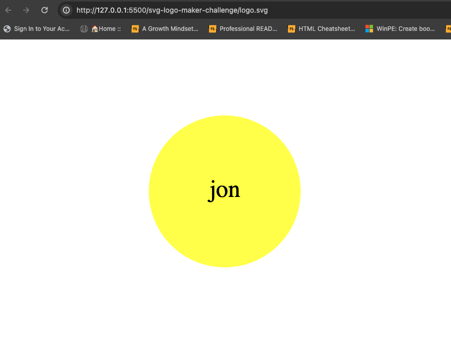

# SVG logo maker
SVG logo maker

## Description
This application generates a simple logo file named logo.sgv when a user is prompted to:
* Enter 3 characters
* Enter color of characters
* Select a list of shapes (circle, triangle, square)
* Enter color you want the shape

The generated logo.sgv file can be viewed when opening in a browser.

## Installation
N/A

## Credits
#jonsantosdev

## Assistance
#codentell, Kyle Vance

## License
MIT

## Repository
https://github.com/jonsantosdev/svg-logo-maker-challenge

## Website
https://jonsantosdev.github.io/svg-logo-maker-challenge/

## Future feature development
* Options for text font
* Options for text bold
* Adding additional shapes
* Choose text size from a list
* Choose shape size from a list

## Sreenshots of logo.svg file created
